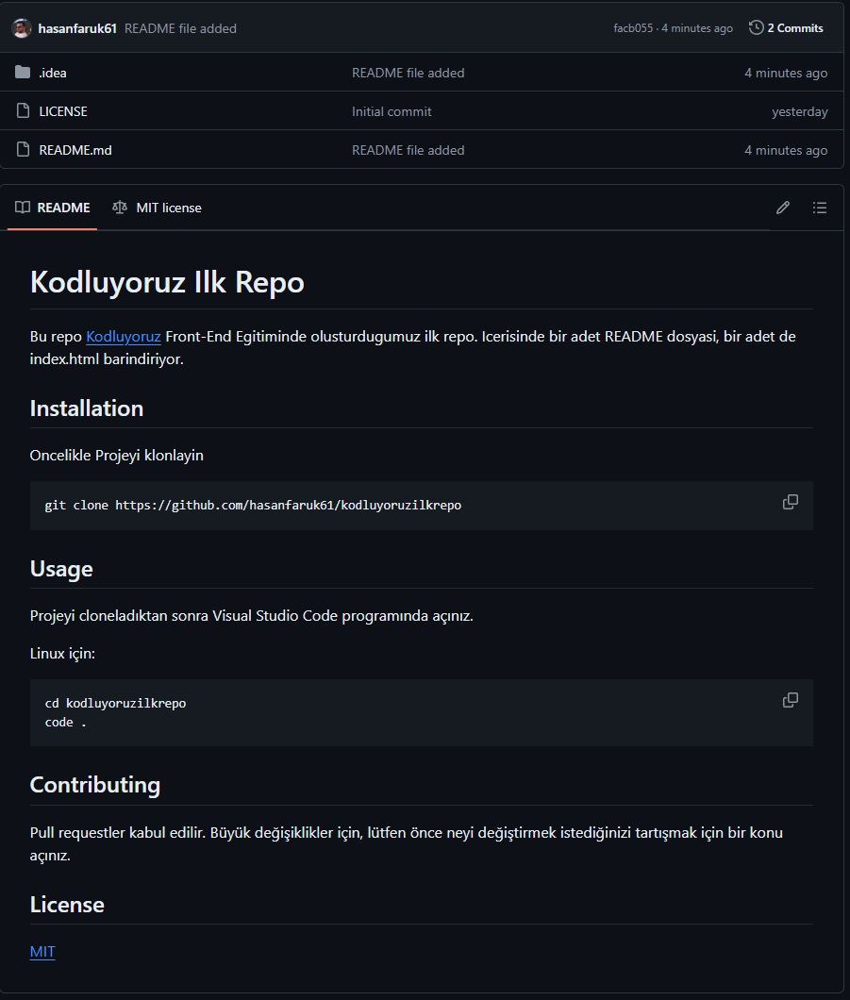

# Kodluyoruz Ilk Repo

Bu repo [Kodluyoruz](https://www.kodluyoruz.org/) Front-End Egitiminde olusturdugumuz ilk repo. Icerisinde bir adet README dosyasi, bir adet de index.html barindiriyor.



## Installation

Oncelikle Projeyi klonlayin

```bash
git clone https://github.com/hasanfaruk61/kodluyoruzilkrepo
```

## Usage

Projeyi cloneladıktan sonra Visual Studio Code programında açınız.

Linux için:
```linux
cd kodluyoruzilkrepo
code .
```

## Contributing
Pull requestler kabul edilir. Büyük değişiklikler için, lütfen önce neyi değiştirmek istediğinizi tartışmak için bir konu açınız.


## License
[MIT](https://choosealicense.com/licenses/mit/)